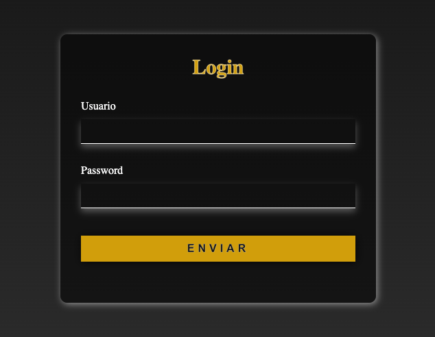

# 🌐 Web Portfolio — Andrés Pérez

Welcome to my personal web portfolio!  
This repository will grow over time as I build and showcase my front-end projects.

## 🚀 Current Project
- **Login Page** — a simple and responsive HTML & CSS project that marks the beginning of this portfolio.

## 🧩 Preview
🔗 **Live Demo:** [View on GitHub Pages](https://andres6294.github.io/login/)  
🖼️ *Example Preview:*  

## 🧠 What’s Next
I’ll keep adding new projects as I continue learning and improving my web development skills — from layout design to interactivity with JavaScript.

## 🛠️ Tech Stack
- HTML5  
- CSS3  
- (JavaScript soon)

---

# 🌐 Portafolio Web — Andrés Pérez

¡Bienvenido a mi portafolio web personal!  
Este repositorio crecerá con el tiempo a medida que construya y muestre mis proyectos de desarrollo front-end.

## 🚀 Proyecto Actual
- **Página de Login** — un proyecto sencillo y adaptable hecho con HTML y CSS que marca el inicio de este portafolio.

## 🧩 Vista Previa
🔗 **Demo en vivo:** [Ver en GitHub Pages](https://andres6294.github.io/login/)  
🖼️ *Vista de ejemplo:*  

## 🧠 Lo Que Viene
Seguiré agregando nuevos proyectos mientras aprendo y mejoro mis habilidades en desarrollo web, desde la maquetación hasta la interactividad con JavaScript.

## 🛠️ Tecnologías
- HTML5  
- CSS3  
- (Próximamente JavaScript)

---

🧩 *Follow my progress / Sigue mi progreso mientras construyo más experiencias web paso a paso.*
